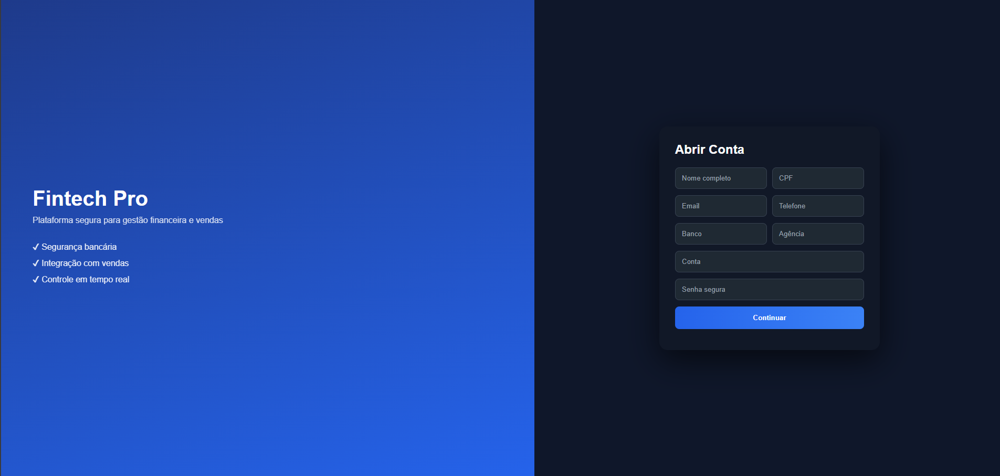

# 💼 Cadastro Financeiro | Sistema de Onboarding

Sistema de cadastro com interface moderna inspirado em plataformas bancárias e fintechs.
Projeto desenvolvido com foco em experiência do usuário, design profissional e integração entre front-end e back-end.

---

## 🚀 Tecnologias utilizadas

* HTML5
* CSS3 (UI moderna e responsiva)
* JavaScript (Vanilla)
* Node.js
* Express

---

## 🎯 Funcionalidades

* Cadastro de usuário
* Validação básica de campos
* Interface estilo fintech (dark mode)
* Integração front-end ↔ back-end
* Simulação de banco de dados em memória

---

## 🖥️ Preview do sistema

*(adicione aqui um print depois)*

---

## 📂 Estrutura do projeto

```
/projeto
 ├── index.html
 ├── style.css
 ├── script.js
 ├── server.js
 └── README.md
```

---

## ⚙️ Como executar o projeto

### 1. Clone o repositório

```bash
git clone https://github.com/paulovkt-dev/cadastro-financeiro

### 2. Acesse a pasta

```bash
cd cadastro-financeiro
```

### 3. Instale as dependências

```bash
npm install
```

### 4. Inicie o servidor

```bash
node server.js
```

### 5. Abra o sistema

Abra o arquivo `index.html` no navegador.

---

## 🔐 Observações

* Este projeto não utiliza banco de dados (dados armazenados temporariamente em memória)
* Ideal para fins de estudo e portfólio
* Pode ser facilmente integrado com MongoDB ou MySQL

---

## 📈 Melhorias futuras

* Validação avançada (CPF, senha forte)
* Máscaras de input
* Cadastro em múltiplas etapas
* Sistema de login
* Integração com banco de dados
* Dashboard financeiro

---

## 👨‍💻 Autor

Desenvolvido por **Paulo Vicktor**

---

## 📌 Licença

Este projeto está sob a licença MIT.

